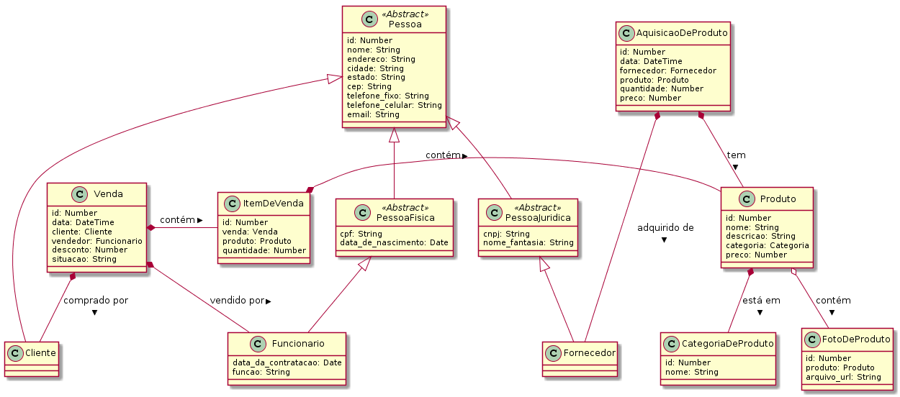

# Funcionalidades e Modelo de dados

O **dj_store** é um software que fornece as seguintes funcionalidades:

* cadastro de fornecedores
* cadastro de produtos (incluindo fotos e categorias de produtos)
* cadastro de aquisições de produtos de fornecedores
* cadastro de funcionários
* cadastro de clientes
* cadastro de vendas de produtos (e itens de venda)

Para isso é utilizado o modelo de dados ilustrado pela figura a seguir.

A figura demonstra a presença das seguintes entidades:

* `Pessoa`: classe abstrata que representa os dados de uma pessoa (nome, endereço, cidade, estado, CEP, telefone fixo, telefone celular e e-mail)
* `PessoaFisica`: classe abstrata que representa os dados de uma pessoa física, que é um tipo de pessoa (CPF e data de nascimento)
* `PessoaJuridica`: classe abstrata que representa os dados de uma pessoa jurídica, que é um tipo de pessoa (CNPJ e nome fantasia)
* `Funcionario`: classe que representa os dados de um funcionário, que é um tipo de pessoa (data da contratação e função)
* `Fornecedor`: classe que representa os dados de um fornecedor de produtos da loja; é um tipo de pessoa (atualmente não acrescenta dados à classe `PessoaJuridica`)
* `Cliente`: classe que representa os dados de um cliente, que é um tipo de pessoa (atualmente não acrescenta dados à classe `Pessoa`)
* `Produto`: classe que representa os dados de um produto (nome, descrição, categoria e preço)
* `CategoriaDeProduto`: classe que representa os dados de uma categoria de produto (nome)
* `FotoDeProduto`: classe que representa os dados de uma foto de um produto (produto relacionado e arquivo_url)
* `AquisicaoDeProduto`: classe que representa os dados de uma aquisição de um produto de um fornecedor (data, fornecedor, produto, quantidade e preço)
* `Venda`: classe que representa os dados de uma venda (data, cliente que realizou a compra, funcionário que realizou a venda, desconto e situação)
* `ItemDeVenda`: classe que representa um item da venda (venda relacionada, produto e quantidade)

Este modelo de dados também é bastante interessante para representar diversas funcionalidades do Django.