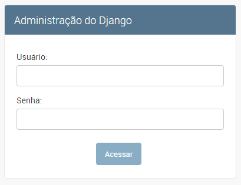
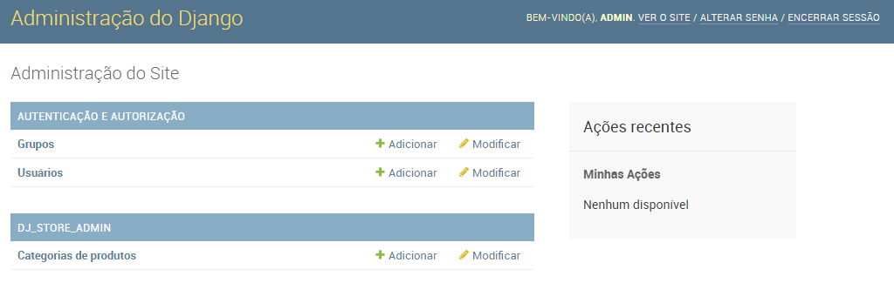
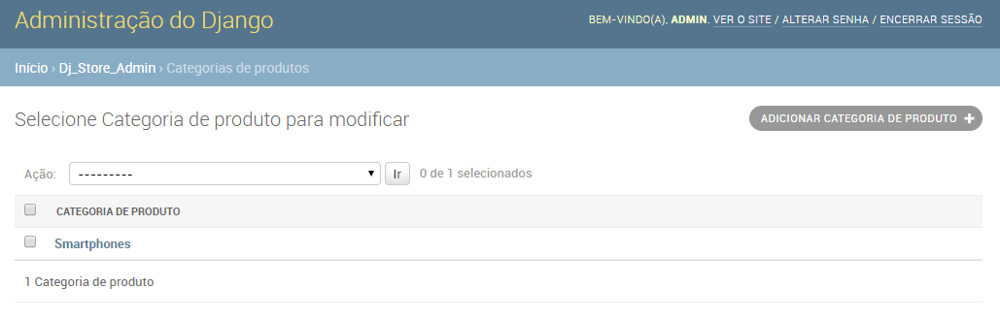
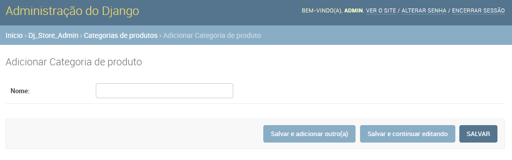

# Django Admin

O **Django Admin** é um aplicativo, fornecido junto com o Django, que cria uma interface administrativa para o gerenciamento dos dados. Esse acesso é protegido por login e senha (por isso é necessário cadastrar o **super-usuário**).

Cada aplicativo do projeto pode utilizar o Django Admin. Para isso, o módulo `admin` deve declarar classes que especificam quais classes do model podem ser gerenciadas. Por exemplo, para permitir o gerenciamento da classe `CategoriaDeProduto` o módulo `admin` fica mais ou menos com o conteúdo a seguir:

```python
from django.contrib import admin
from .models import *

@admin.register(CategoriaDeProduto)
class CategoriaDeProdutoAdmin(admin.ModelAdmin):
    pass
```

A classe `CategoriaDeProdutoAdmin` herda de `ModelAdmin`, fornecida pelo pacote `django.contrib.admin`. O código utiliza o **decorator** `admin.register()` para indicar para a classe `CategoriaDeProdutoAdmin` qual classe do model ela vai gerenciar.

**Observação**: um decorator é um recurso do python para definir metadados de uma classe. Na prática, um *decorator* é implementado por uma função.

Para acessar o Django admin, com o servidor web em execução, acesse o endereço `http://localhost:8000/admin`. O conteúdo da página é semelhante ao ilustrado pela figura a seguir.



A figura ilustra a *Tela de login* do Django Admin. A tela apresenta um formulário com dois campos: usuário e senha. Para acessar, informe o nome de usuário e sua senha criados ao executar o comando `createsuperuser`.

Ao acessar o Django admin apresenta a *Tela Inicial da Administração*, que apresenta a lista de aplicativos e links para telas que permitem o gerenciamento dos dados. Essa tela é ilustrada pela figura a seguir.



Para cada aplicativo a tela apresenta a lista de *admins*. No exemplo, há o link para a tela de admin *Listar categorias de produtos* bem como o link "Modificar", que leva à tela de *Cadastrar categoria de produto*. As figuras a seguir ilustram essas telas, respectivamente.





A tela *Listar categorias de produtos* apresenta uma interface que mostra a lista das categorias de produtos, permite selecionar registros e executar uma ação (por exemplo, excluir). A tela também contém um botão que é um link para a página *Cadastrar categoria de produto*.

A tela *Cadastrar categoria de produto* apresenta um formulário com o campo *Nome*. 