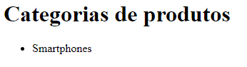

# Views, Templates e URLs

Equando o model declara classes que representam o modelo de dados, view e template representam, respectivamente, a lógica de negócio e a interface gráfica.

As views são descritas no módulo `views` e podem ser de dois tipos:

* baseadas em função
* baseadas em classe

Para exemplificar, vamos criar uma view baseada em função e um template para apresentar a lista de notícias.

A view baseada em função é, como o nome diz, uma função python que segue uma estrutura padrão:

* tem o parâmetro `request`
* tem um retorno (geralmente resultado da função `render()`)

O código a seguir ilustra isso de forma mais prática:

```python
from django.shortcuts import render
from .models import *

def categoriadeproduto_list(request):
    categorias = CategoriaDeProduto.objects.all()
    return render(request, 'dj_store_admin/categoriadeproduto_list.html', {'categorias': categorias})
```

A função `render()` é fornecida pelo pacote `django.shortcuts`. A função `categoriadeproduto_list()` tem o parâmetro `request` e seu código realiza o seguinte:

1. obtém a lista das categorias, usando `CategoriaDeProduto.objects.all()`
2. retorna o resultado da chamada do método `render()`

A lista das categorias é obtida utilizando o **manager** da classe `CategoriaDeProduto`, o atributo da classe chamado `objects`. Cada classe do model possui o seu próprio manager. 

O atributo `objects` (manager de `CategoriaDeProduto`) possui o método `all()`, que retorna um `QuerySet`, fornecendo uma maneira de obter (consultar) todas as instâncias do model `CategoriaDeProduto`, ou seja, as categorias de produtos.

**Importante**: aprender a utilizar corretamente os métodos do manager do model é uma parte fundamental do processo de desenvolvimento de software Django. Este curso não ilustra a utilização de todos os métodos, por isso, sempre que necessário, recorra à documentação do Django.

O método `render()` recebe três parâmetros:

1. o objeto `request` (parâmetro da função `categoriadeproduto_list`)
2. o nome do template
3. o dicionário de dados fornecido para o template

O nome do template é uma composição no formato `aplicativo/arquivo.html`. Na prática, o nome do template permite ao Django referenciar o arquivo que está em `dj_store_admin/templates/dj_store_admin/categoriadeproduto_list.html`. 

O dicionário de dados passado para o template permite à view fornecer dados para o template. Neste caso a chave `categorias` contém o valor da variável `categorias` (que contém a lista de categorias de produtos). 

No template `dj_store_admin/categoriadeproduto_list.html` o código é o seguinte:

```html
<h1>Categorias de produtos</h1>
<ul>
    
    <li>{{ categoria.nome }}</li>
    
</ul>
```

O arquivo, embora com a extensão `.html`, está no formato da *linguagem de template do Django*, que é uma mistura de HTML com outras marcações específicas do Django. Nesse caso, para apresentar a lista de categorias, é utilizada a tag `for`, que permite realizar uma iteração em `categorias`. Dentro da tag `for` há o código:

```html
<li>{{ categoria.nome }}</li>
```

O código utiliza a sintaxe de variável da linguagem de template do django para apresentar (ou imprimir) o valor da expressão `categoria.nome` para apresentar o nome de cada categoria. 

**Importante**: Observe que o ORM permite utilizar os campos da instância como atributos do objeto.

## URLs

Escrever view e template é apenas parte do processo. Outra parte fundamental é permitir que o Django encontre a view. Isso é feito por meio de uma **URL**, um localizador da view baseado em um caminho. Para criar URLs é necessário modificar (ou criar) o módulo `urls` do aplicativo:

```python
from django.urls import path
from .views import *

app_name = 'dj_store_admin'

urlpatterns = [
    path('categorias/', categoriadeproduto_list, name='categoriadeproduto_list')
]
```

O código importa a função `path()`, fornecida por `django.urls` e todas as views do aplicativo. A variável `app_name` é importante por permitir que as URLs sejam organizadas no aplicativo e não se confundam com URLs declaradas em outros aplicativos. 

A função `path()` é utilizada para criar itens na lista `urlpatterns` e recebe três parâmetros:

* o caminho (ou rota) da URL
* a view
* o nome do caminho (por meio do parâmetro nomeado `name`)

O caminho `'categorias/'` serve para indicar como será possível encontrar a view `categoriadeproduto_list`. Por hora, o nome do caminho não é importante.

### Registrando URLs do aplicativo no projeto

Por fim, o último passo é registrar as URLs do aplicativo no projeto. Isso é feito modificando o módulo `urls` do projeto:

```python
from django.contrib import admin
from django.urls import path, include

urlpatterns = [
    path('admin/', admin.site.urls),
    path('', include('dj_store_admin.urls'))
]
```

A variável `urlpatterns` define a lista dos caminhos:

1. o caminho `'admin/'` registra as URLs do Django Admin
2. o caminho `''` (também chamado de caminho raiz ou padrão) registra as URLs do `dj_store_admin` utilizando a função `include()`

Registrar as URLs de um arquivo no caminho raiz significa que as URLs não serão alteradas e poderão ser acessadas a partir da *raiz do site*. Por exemplo, a URL `categorias/` poderá ser acessada com uma requisição para  `http://localhost:8000/categorias/`. O resultado é ilustrado pela figura a seguir.



A página apresenta uma lista com os nomes das categorias de produtos.

## URLConf e urlresolver

O **URLConf** é o mecanismo do Django que permite declarar as URLs do software. O **urlresolver** é o mecanismo do Django que encontra uma URL utilizando *padrões* para que o Django saiba qual view deve entregar. O caminho de uma URL é o padrão que o Django utiliza para encontrar a view.

Até agora o software tem os seguintes padrões de URLs registrados:

* `admin/`: padrão para o django admin
* `categorias/`: padrão para view `categoriadeproduto_list`

Quando servidor web recebe uma requisição o urlresolver começa a procurar o padrão mais adequado para identificar qual view entregar. Por exemplo, se a requisição for para a URL `http://localhost:8000/categorias/` o urlresolver busca os padrões de URL e identifica que deve entregar a view `categoriadeproduto_list`. Entretanto, se requisição for `http://localhost:8000/` o urlresolver não conseguirá identificar uma view, porque não há um padrão que combine com essa URL. Nesse caso o Django retorna uma view padrão que representa uma página de erro (*404 - Página não encontrada*).
