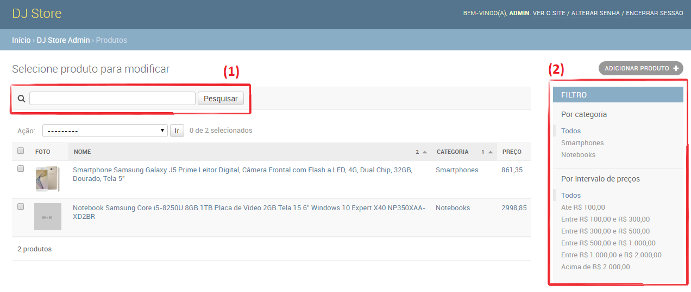
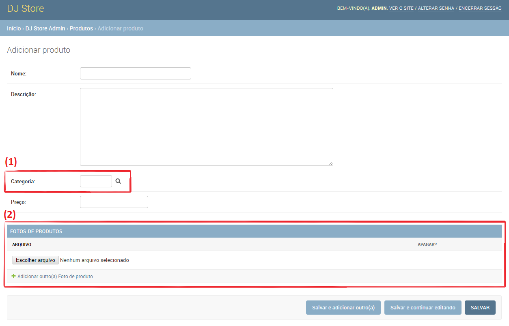

# Model para Produto e melhorias no Django Admin

Continuando a descrição do model vamos descrever as entidades `Produto` e `FotoDeProduto`. Para isso é necessário utilizar o recurso de **relacionamento** do ORM Django, como demonstra o código a seguir:

```python
class Produto(models.Model):
    nome = models.CharField(max_length=128)
    descricao = models.TextField('Descrição')
    categoria = models.ForeignKey(
        CategoriaDeProduto, 
        on_delete=models.CASCADE, 
        related_name='produtos')
    preco = models.FloatField('Preço')

    def __str__(self):
        return self.nome

    @property
    def foto_da_capa(self):
        if self.fotos.count() == 0:
            return None
        return self.fotos.all()[0]


class FotoDeProduto(models.Model):
    class Meta:
        verbose_name = 'Foto de produto'
        verbose_name_plural = 'Fotos de produtos'

    produto = models.ForeignKey(
        Produto, 
        on_delete=models.CASCADE, 
        related_name='fotos')
    arquivo = models.FileField()

    def __str__(self):
        return self.arquivo.name
```

A classe `Produto` possui os campos:

|Campo              |                 Tipo| Descriçao                   |
|-------------------|---------------------|-----------------------------|
|`nome`|`CharField`|Nome do produto; uma sequência de caracteres        |
|`descricao`|`TextField`|Descrição do produto; uma sequência de caracteres com quebra de linha|
|`categoria`|`ForeignKey`|A categoria do produto; relacionamento **muitos-para-um com** `Categoria`|
|`preco`|`FloatField`|O preço do produto; número float|

O campo do tipo `ForeignKey` permite criar um relacionamento **muitos-para-um**, ou seja: uma categoria tem vários produtos: `Produto n -- 1 Categoria`.

Os parâmetros para o construtor de `ForeignKey` são:

* o model do relacionamento
* `on_delete`: a estratégia de exclusão. O valor `models.CASCADE` indica que quando uma categoria for excluída os produtos relacionados também serão
* `related_name`: indica que será criado um campo no model relacionado para representar o outro lado da relação. O valor `produtos` indica que o `Categoria` tem um campo `produtos`, que contém a lista de produtos da categoria.

A classe `FotoDeProduto` possui os campos:

|Campo|Tipo|Descrição|
|-----|----|---------|
|`produto`|`ForeignKey`|O produto da foto; relacionamento **muitos-para-um** com `Produto`|
|`arquivo`|`FileField`|O arquivo (imagem) da foto|

A classe contém o relacionamento **muitos-para-um** com `Produto`, ou seja: um produto tem várias fotos: `Produto 1 -- n FotoDeProduto`. O campo do tipo `FileField` permite fazer upload de um arquivo (imagem).

No método `__str__()` da classe `FotoDeProduto` está sendo utilizado o atributo `name` do campo `arquivo` para utilizar o nome do arquivo como a representação de string de uma instância desse model.

A classe `Produto` também declara o método `foto_da_capa()`, que opera da seguinte forma:

* se o produto não tiver foto, retorna `None`
* caso contrário, retorna a primeira foto

Para o segundo caso, o código utiliza o campo `fotos`, que o lado inverso (*related*) do relacionamento criado por `FotoDoProduto.produto`. 

Outros tipos de campos são:

* `BooleanField`: representa um valor lógico (`True` ou `False`)
* `DateField`: representa uma data (com dia, mês e ano)
* DateTimeField: representa uma data (com dia, mês, ano, hora, minutos e segundos)
* EmailField: representa um e-mail
* IntegerField: representa um número inteiro
* SlugField: representa um *slug*
* URLField: representa uma URL

Um *slug* é um termo comum em desenvolvimento de software web e é representa uma string sem caracteres especiais (como acentos) e sem espaços, sendo comumente utilizada para criar *URLs amigáveis*. Por exemplo, o produto de nome "Smartphone 6" 64 GB" teria o slug **"smartphone-6-64-gb"**.

## Melhorias no Django Admin

Cada classe do módulo `admin` pode ser personalizada para adicionar funcionalidades diversas à interface de administração. A figura a seguir ilustra a tela *Lista de produtos* obtida ao final das configurações da interface administrativa.



Em destaque na figura estão dois elementos importantes da interface:

1. **Campo de pesquisa**: apresenta um campo de texto que permite ao usuário utilizar a funcionalidade de pesquisar de produtos
2. **Painel de filtros**: apresenta filtros que permitem navegar pelo conjunto de dados conforme o comportamento de cada filtro. Cada filtro aplica uma transformação na consulta que gera a lista de produtos e, assim, apresenta produtos de acordo com uma condição. Na figura há dois filtros: por categoria e por intervalo de preços.

A figura a seguir ilustra a tela *Adicionar produto* obtida ao final das configurações da interface administrativa.



Em destaque na figura estão dois elementos importantes:

1. o campo categoria usa uma interface que permite localizar a categoria (clicando no ícone da lupa)
2. o formulário inline *Fotos de produtos* permite cadastrar várias fotos para o produto. O link "Adicionar outro(a) Foto de produto" permite adicionar nova foto

Esta seção mostra vários recursos considerando as classes `Produto` e `FotoDeProduto`.

### Código completo

Para começar, a seguir o código completo da interface de administração:

```python
from django.utils.html import format_html

class FotoDeProdutoInline(admin.TabularInline):
    model = FotoDeProduto
    extra = 1


class IntervaloDePrecoDeProdutoListFilter(admin.SimpleListFilter):
    title = 'Intervalo de preços'
    parameter_name = 'intervalo_de_preco'

    def lookups(self, request, model_admin):
        return (
            ('0-100', 'Até R$ 100,00'),
            ('100-300', 'Entre R$ 100,00 e R$ 300,00'),
            ('300-500', 'Entre R$ 300,00 e R$ 500,00'),
            ('500-1000', 'Entre R$ 500,00 e R$ 1.000,00'),
            ('1000-2000', 'Entre R$ 1.000,00 e R$ 2.000,00'),
            ('2000-', 'Acima de R$ 2.000,00')
        )

    def queryset(self, request, queryset):
        if self.value() == '0-100':
            return queryset.filter(preco__lte=100)
        if self.value() == '100-300':
            return queryset.filter(preco__gt=100, preco__lte=300)
        if self.value() == '300-500':
            return queryset.filter(preco__gt=300, preco__lte=500)
        if self.value() == '500-1000':
            return queryset.filter(preco__gt=500, preco__lte=1000)
        if self.value() == '1000-2000':
            return queryset.filter(preco__gt=1000, preco__lte=2000)
        if self.value() == '2000-':
            return queryset.filter(preco__gt=2000)


@admin.register(Produto)
class ProdutoAdmin(admin.ModelAdmin):
    inlines = (FotoDeProdutoInline, )
    list_select_related = ('categoria', )
    list_display = ('foto', 'nome', 'categoria', 'preco')
    list_display_links = list_display
    list_filter = ('categoria', IntervaloDePrecoDeProdutoListFilter)
    list_per_page = 25
    ordering = ('categoria', 'nome')
    raw_id_fields = ('categoria', )
    search_fields = ('categoria__nome', 'nome', 'descricao')

    def foto(self, obj):
        imagem = obj.foto_da_capa
        return format_html('',
                           imagem.arquivo.url if imagem else 'https://via.placeholder.com/50'
                           )
    foto.short_description = 'Foto'
```

A classe `ProdutoAdmin` tem os seguintes atributos:

* `inlines`: define a lista de *formulários inline*. Formulários inline permitem que o formulário de cadastro de produto tenha também o cadastro das fotos
* `list_select_related`: define a lista de campos que indicam ao Django quais models (tabelas) devem ser carregadas em conjunto com os dados de Produto. Nesse caso, o objetivo é carregar os dados de categorias junto com dados de produtos
* `list_display`: determina quais colunas devem aparecer na tela *Lista de produtos*. Atenção para primeiro item da lista, `foto` (mais detalhes adiante)
* `list_display_links`: determina quais colunas devem ser links para a tela *Detalhes de produto*
* `list_filter`: define a lista de filtros da tela *Lista de produtos*. Os filtros aparecem do lado direito da tela e permitem navegar pelos resultados de forma intuitiva. Atenção para o último item da lista `IntervalodePrecoDeProdutoListFilter` (mais detalhes adiante)
* `list_per_page`: determina a quantidade de registros de cada página da Lista de produtos
* `ordering`: determina a forma de ordenação da lista de produtos
* `raw_id_fields`: determina quais campos devem usar a interface de pesquisa na tela *Cadastrar produto*
* `search_fields`: apresenta um campo de busca na tela *Lista de produtos* e determina quais campos devem ser considerados na busca. O primeiro item `categoria__nome` permite que a busca considere o nome da categoria do produto. A sintaxe de dois sublinhados serve para representar um campo do relacionamento

O atributo `inlines` contém os formulários inline. Para isso é necessário observar a classe `FotoDeProdutoInline`:

* herda de `TabularInline`
* o atributo `model` determina o model utilizado
* o atributo `extra` determina a quantidade padrão de linhas

O atributo `list_display` da classe `ProdutoAdmin` contém `'foto'`. É importante destacar que o model `Produto` não possui este campo, então o valor é resultante da função `foto()`, declarada na própria classe `ProdutoAdmin`. Essa função define uma string em formato HTML para apresentar a imagem do produto. A imagem é obtida por meio da propriedade `foto_da_capa` que, embora definida como um método de `Produto`, pode ser utilizada como um atributo por causa da anotação `@property`. Importante notar que o campo `FotoDoProduto.arquivo`, do tipo `FileField`, possui o atributo `url`, que retorna a URL da imagem do arquivo.  A sintaxe `foto.short_description` permite definir o cabeçalho da coluna.

O atributo `list_filter` contém o item `IntervaloDePrecoDeProdutoListFilter`, que é uma classe que implementa um filtro da lista de produtos e tem as características:

* herda de `SimpleListFilter`
* o atributo `title` determina o título do filtro (usado na coluna da direita na tela *Lista de produtos*)
* o atributo `parameter_name` determina o nome do parâmetro de URL associado ao filtro
* o método `lookups()` determina as opções possíveis
* o método `queryset()` obtém o valor do parâmetro de URL associado ao filtro e aplica filtros no `queryset` da lista de produtos

### Field lookup

O código do método `queryset()` faz uso do método `filter()` e do recurso **field lookup**, que segue o formato: `campo__pesquisa=valor`. Por exemplo: `preco__lte=300` tem:

* campo: `preco`
* pesquisa: `lte` (menor ou igual que)
* valor: `300`

Os métodos `filter()` e `get()` são alguns dos que suportam expressões lookup.

## Tipos de relacionamentos 

O ORM do Django implementa os seguintes tipos de relacionamentos:

* `OneToOne`: relacionamento **um-para-um**. Utilizado para representar, por exemplo, herança 
* `ForeignKey`: relacionamento **muitos-para-um**, já demonstrado nos códigos anteriores
* `ManyToManyField`: relacionamento **muitos-para-muitos**

Os parâmetros para os construtores desses tipos campos são semelhantes, com exceção do `ManyToManyField`, que não possui `on_delete`.
