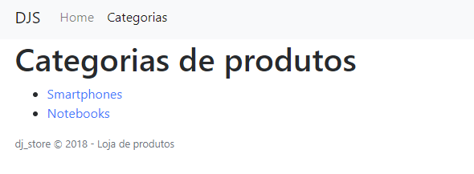

# Melhorias no template

A interface do software é determinante para a interação com o usuário; não apenas de forma estética (visual), mas também em termos de usabilidade. 

Para conseguir um resultado interessante podemos utilizar o **Bootstrap**, um framework de interface para a web.

Para fazer isso, instale o pacote `django-bootstrap4` e configure-o no projeto (veja [Prática 1](6-pratica_1.md)).

## Template base e blocks

Na sequência, uma abordagem interessante é utilizar um **template base** e extendê-lo em templates específicos. O código a seguir mostra o template base `dj_store_admin/base.html`:

```html

<!doctype html>
<html lang="pt-br">

<head>
  <meta charset="utf-8">
  <meta name="viewport" content="width=device-width, initial-scale=1, shrink-to-fit=no">

  
  
  

  <title> | DJ Store</title>
</head>

<body>
  <nav class="navbar navbar-expand-lg navbar-light bg-light">
    <div class="container">
      <a class="navbar-brand" href="#">DJS</a>
      <button class="navbar-toggler" type="button" data-toggle="collapse" data-target="#navbarSupportedContent"
        aria-controls="navbarSupportedContent" aria-expanded="false" aria-label="Toggle navigation">
        <span class="navbar-toggler-icon"></span>
      </button>

      <div class="collapse navbar-collapse" id="navbarSupportedContent">
        <ul class="navbar-nav mr-auto">
          <li class="nav-item">
            <a class="nav-link" href="#">Home</a>
          </li>
          
          <li class="nav-item active">
            <a class="nav-link" href="{{ categorias_url }}">Categorias</a>
          </li>
        </ul>
      </div>
    </div>
  </nav>

  <div class="container">
    
    
  </div>

  <footer>
    <div class="container">
      <p class="small text-muted">dj_store &copy; 2018 &dash; Loja de produtos</p>
    </div>
  </footer>

  
  
  
</body>

</html>
```

O template base utiliza a tag `block` para criar blocos no template que podem ser reescritos nos templates específicos:

* `title`: o conteúdo do elemento `title`
* `extra_head`: conteúdo adicional para o elemento `head`
* `contents`: conteúdo da página
* `document_loaded`: conteúdo adicional ao final do documento

## Usando o template base e definindo conteúdo de blocks

O template base pode ser utilizado por meio da tag `extends`. A seguir, o template para a página que mostra a lista de categorias:

```html

Detalhes da categoria {{categoria.nome}}

<h1>Categorias de produtos</h1>
<ul>
    
    <li>
        <a href="">
            {{ categoria.nome }}
        </a>
    </li>
    
</ul>

```

Além de utilizar a tag `extends` o template utiliza a tag `block` para definir conteúdos de alguns blocos do template.

A figura a seguir ilustra a tela.



A figura mostra que há uma barra de navegação no topo (definida no template base), o título da página, a lista dos produtos e o rodapé (também definido no template base).
